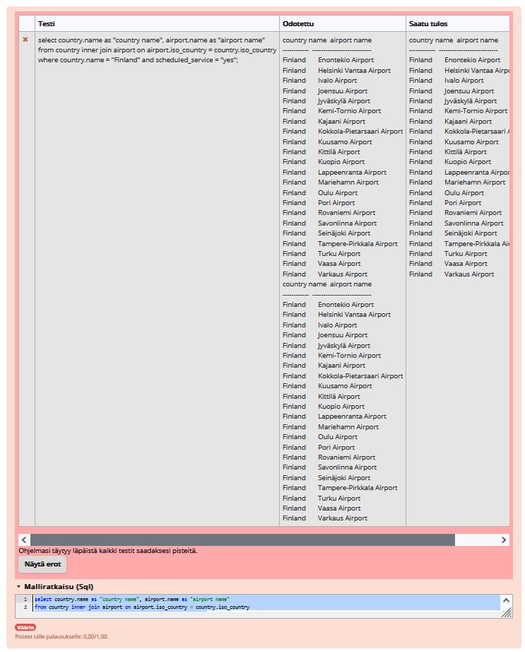
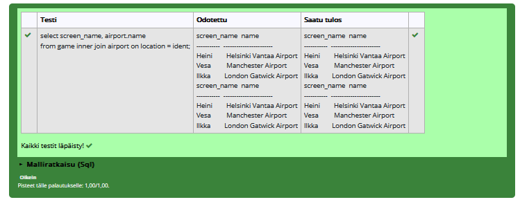
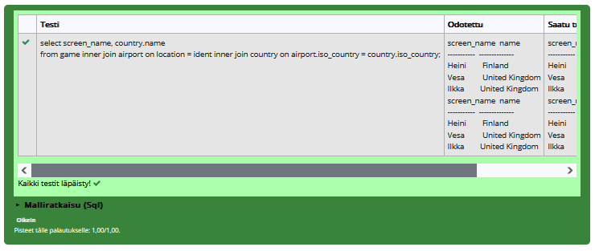

# Join harjoitukset

### Tehtävä 1
select country.name as "country name", airport.name as "airport name"  from airport
inner join country on airport.iso_country = country.iso_country
where country.name = "finland"
and airport.scheduled_service = "yes";

### Tehtävä 2
select screen_name, airport.name
from game
inner join airport on location = ident;

### Tehtävä 3
select screen_name, country.name
from game
inner join airport on location = ident
inner join country on airport.iso_country = country.iso_country;

### Tehtävä 4
select airport.name, screen_name
from game
right join airport on location = ident
where airport.name like "%hels%";

### Tehtävä 5
select goal.name, screen_name
from game
right join goal_reached on game.id = game_id
right join goal on goal_id = goal.id;

