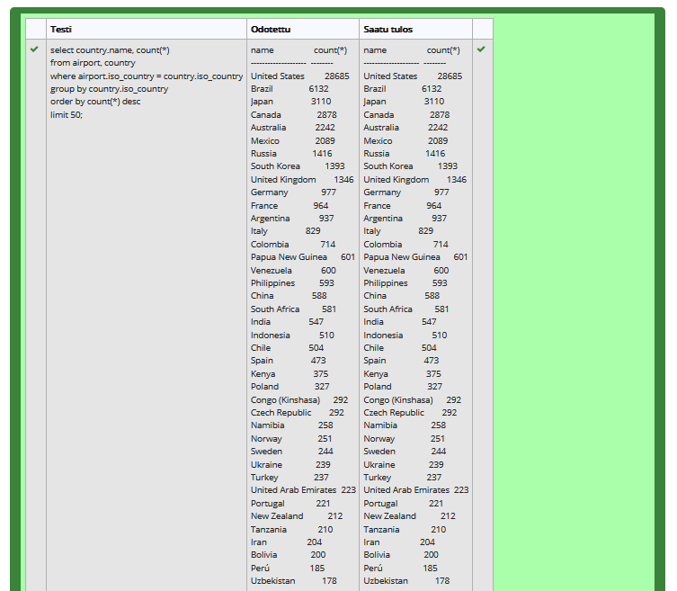

# Koostetietokyselyt harjoitukset

### Tehtävä 1
select max(elevation_ft) from airport;

### Tehtävä 2
select continent, count(*)
from country
group by continent;

### Tehtävä 3
select screen_name, count(*)
from game
inner join goal_reached on game_id = game.id
inner join goal on goal_reached.goal_id = goal.id
group by screen_name;

### Tehtävä 4
select screen_name
from game
where co2_consumed in (
    select min(co2_consumed)
    from game
)

### Tehtävä 5
select country.name, count(*)
from country
inner join airport on country.iso_country = airport.iso_country
group by country.name
order by count(*) desc, country.name asc limit 50;

### Tehtävä 6
select country.name 
from country
inner join airport on airport.iso_country = country.iso_country
group by airport.iso_country
having count(*) > 1000;

### Tehtävä 7
select airport.name
from airport
where elevation_ft in(
    select max(elevation_ft)
    from airport
)

### Tehtävä 8
select country.name
from airport
inner join country on country.iso_country = airport.iso_country
where elevation_ft in(
    select max(elevation_ft)
    from airport
)

### Tehtävä 9
select count(*)
from game
inner join goal_reached on game.id = goal_reached.game_id
inner join goal on game_id = goal.id
where screen_name = "vesa"
group by screen_name;

### Tehtävä 10
select airport.name
from airport
where latitude_deg in(
    select min(latitude_deg)
    from airport
);

