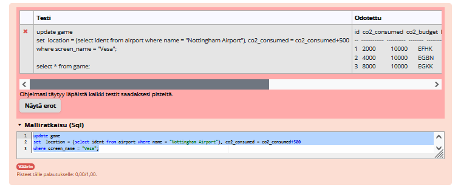
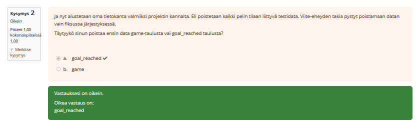
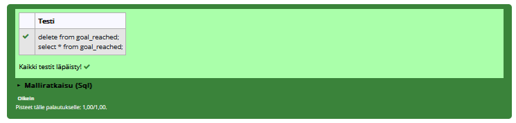
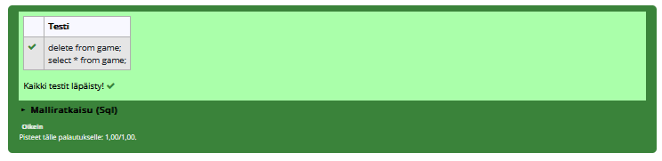

# Päivityskyselyt harjoitukset

### Tehtävä 1
update game
set location =
(
    select ident
    from airport
    where name = "Nottingham Airport"
),
    co2_consumed = co2_consumed + 500
where screen_name = "vesa";

### Tehtävä 2
a

### Tehtävä 3
delete from goal_reached;

### Tehtävä 4
delete from game;

