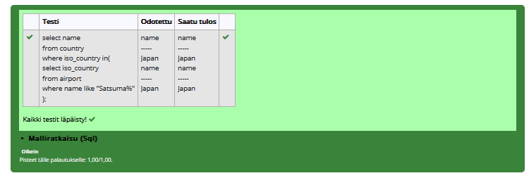
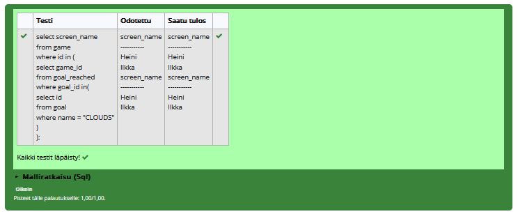
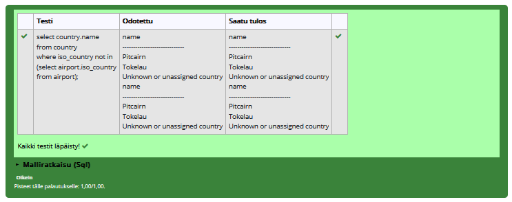
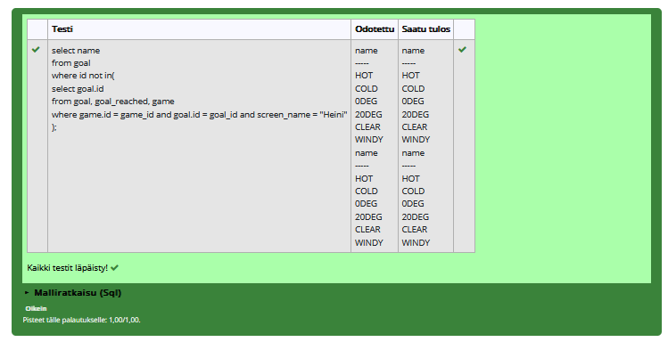

# Sisäkysely harjoitukset

### Tehtävä 1
select country.name
from country
where country.iso_country in
(
    select airport.iso_country
    from airport
    where name like "%satsuma%"
);

### Tehtävä 2
select airport.name
from airport
where airport.iso_country in
(
    select country.iso_country
    from country
    where name = "Monaco"
);

### Tehtävä 3
select screen_name
from game
where game.id in
(
    select game_id
    from goal_reached
    where goal_id in (
        select goal.id
        from goal
        where name = "CLOUDS"
    )
)

### Tehtävä 4
select name
from country
where iso_country not in (
    select iso_country
    from airport
)

### Tehtävä 5
select name
from goal
where id not in (
    select goal_id
    from goal_reached
    where game_id in (
        select id
        from game
        where screen_name = "Heini"
    )
)
