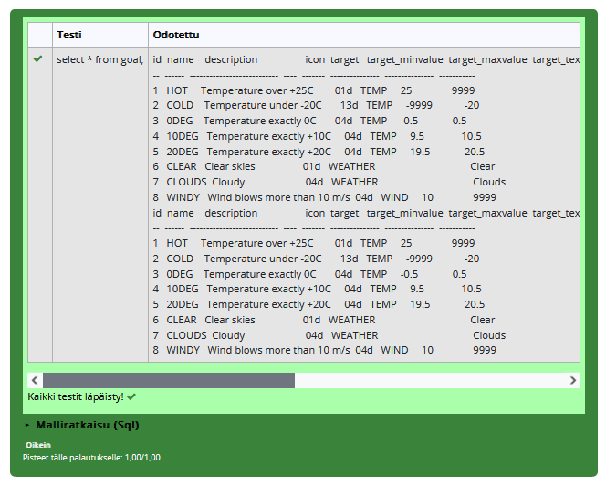
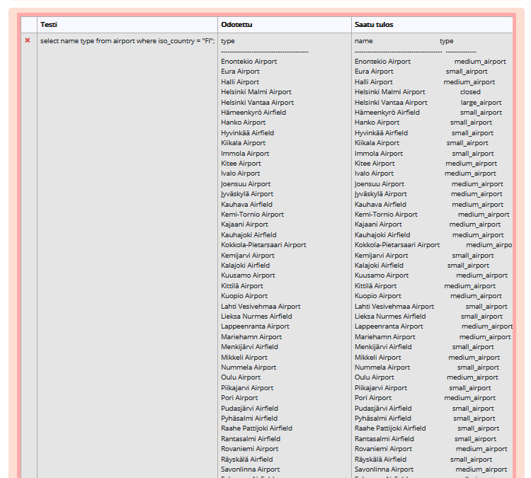
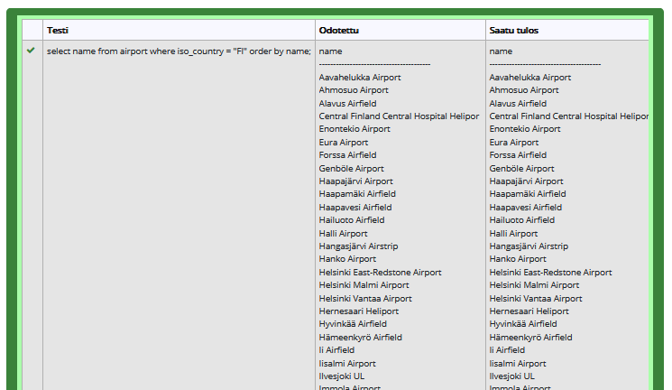
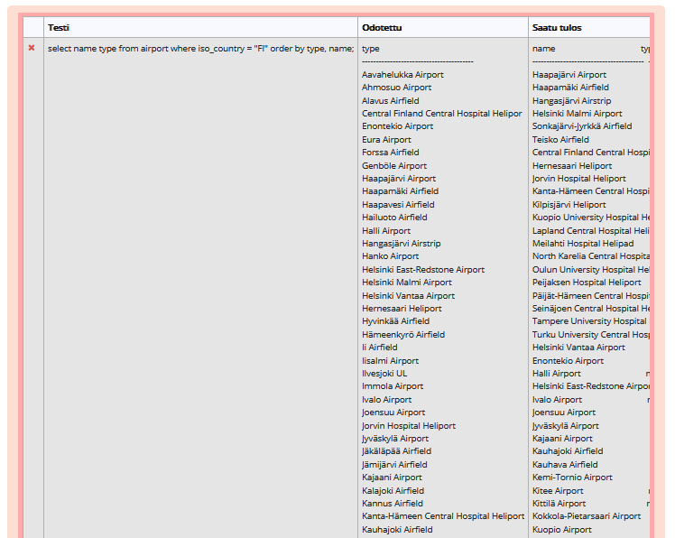
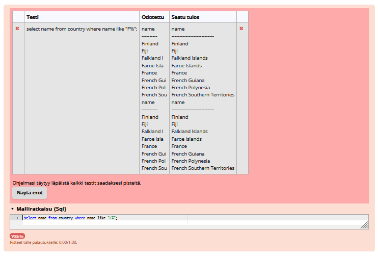
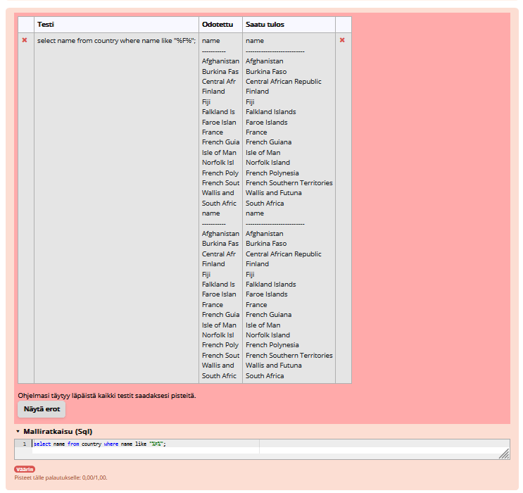
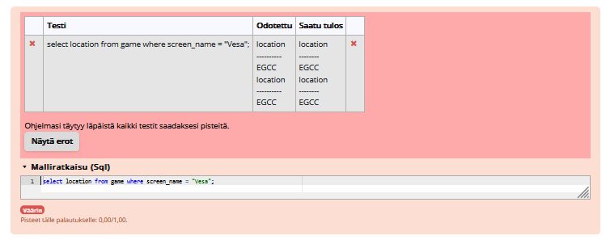
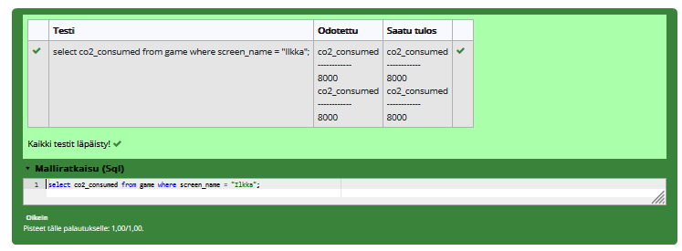
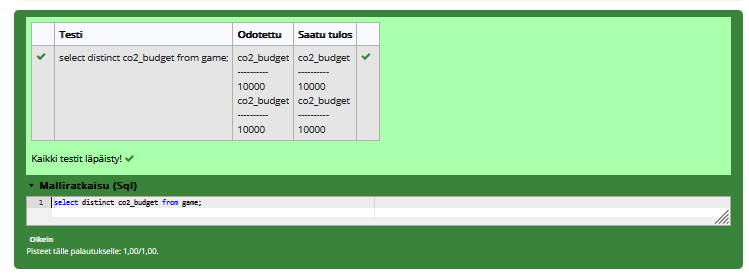

# Yhteen tauluun kohdistetut kyselyt

### Tehtävä 1
select * from goal;

### Tehtävä 2
select name, type from airport 
where iso_country = "FI";

### Tehtävä 3
select name from airport 
where iso_country = "FI" order by name asc;

### Tehtävä 4
select name, type from airport 
where iso_country = "FI" order by type, name;

### Tehtävä 5
select name from country 
where name like "F%";

### Tehtävä 6
select name from country 
where name like "%F%";

### Tehtävä 7
select location from game 
where screen_name = "Vesa";

### Tehtävä 8
select co2_consumed from game 
where screen_name = "Ilkka";

### Tehtävä 9
select co2_budget from game group by co2_budget;
