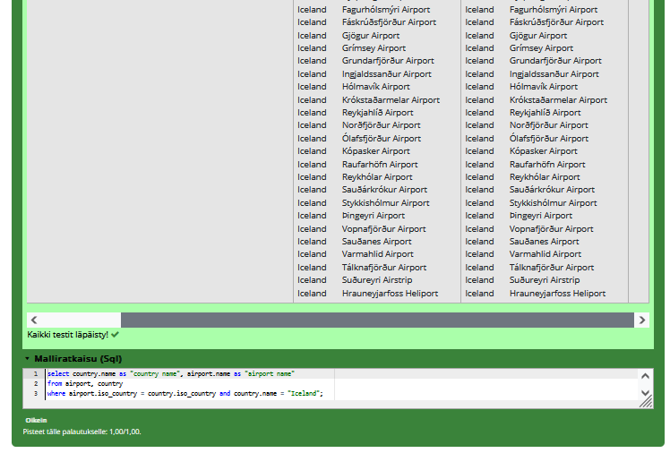
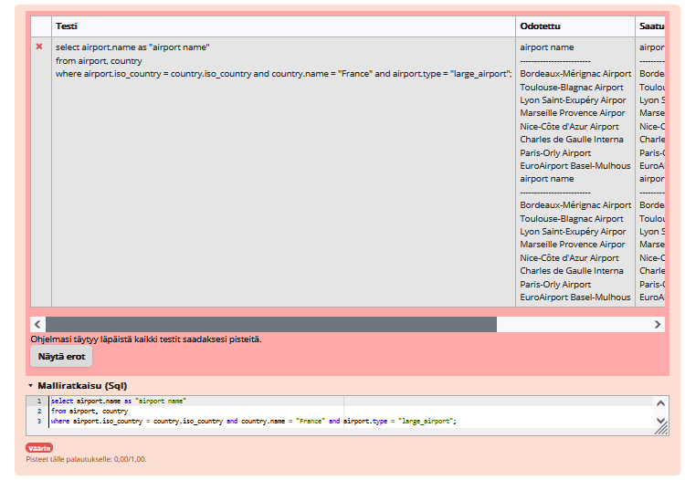
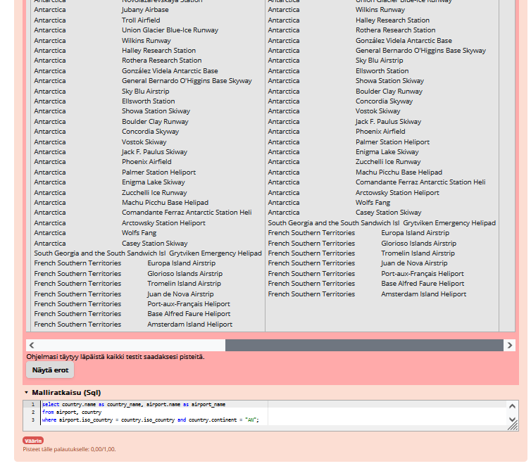
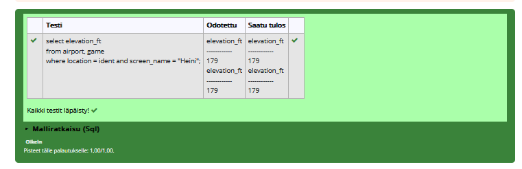
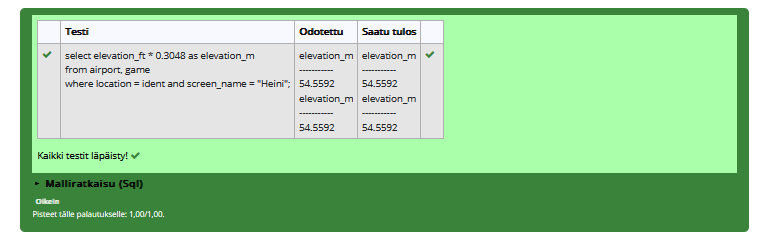
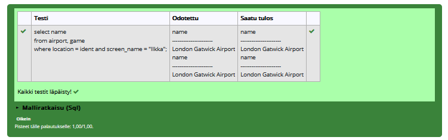
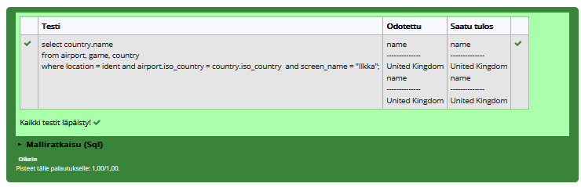
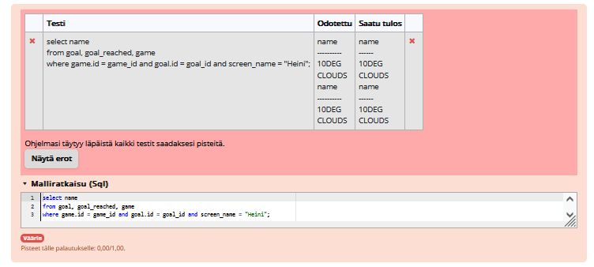
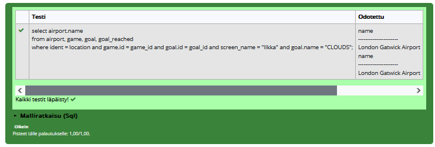
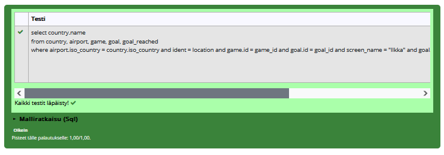

# where-osan liitosehto harjoitukset

### Tehtävä 1
select country.name as "country name", airport.name as "airport name"
from airport, country
where airport.iso_country = country.iso_country
and country.name = "Iceland";

### Tehtävä 2
select airport.name as "airport name"
from airport, country
where airport.iso_country = country.iso_country
and country.name = "France"
and type = "large_airport";

### Tehtävä 3
select country.name as "country_name", airport.name as "airport_name"
from country, airport
where airport.iso_country = country.iso_country 
and airport.continent = "AN";

### Tehtävä 4
select airport.elevation_ft from game, airport
where game.location = airport.ident
and screen_name = "Heini";

### Tehtävä 5
select airport.elevation_ft * 0.3048 as elevation_m from game, airport
where game.location = airport.ident
and screen_name = "Heini";

### Tehtävä 6
select airport.name from game, airport
where game.location = airport.ident
and screen_name = "Ilkka";

### Tehtävä 7
select country.name from game, country, airport
where game.location = airport.ident
and airport.iso_country = country.iso_country
and screen_name = "Ilkka";

### Tehtävä 8
select goal.name from game, goal_reached, goal
where game_id = game.id
and goal_id = goal.id
and screen_name = "Heini";

### Tehtävä 9
select airport.name from game, goal_reached, goal, airport
where game_id = game.id
and goal_id = goal.id
and location = ident
and screen_name = "Ilkka"
and goal.name like "%CLOUDS%";

### Tehtävä 10
select country.name from game, goal_reached, goal, airport, country
where game_id = game.id
and goal_id = goal.id
and location = ident
and screen_name = "Ilkka"
and airport.iso_country = country.iso_country
and goal.name like "%CLOUDS%";
